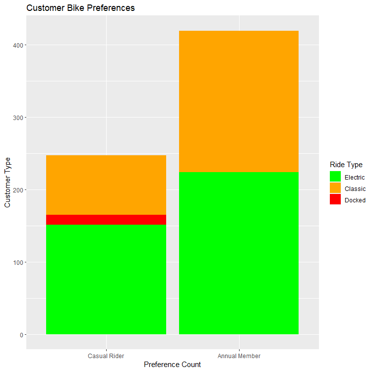
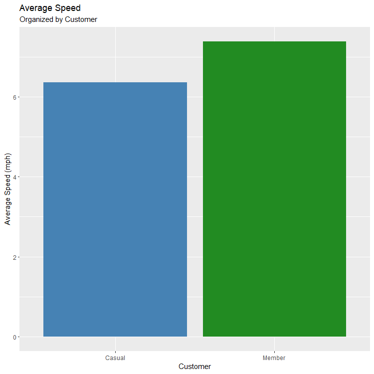
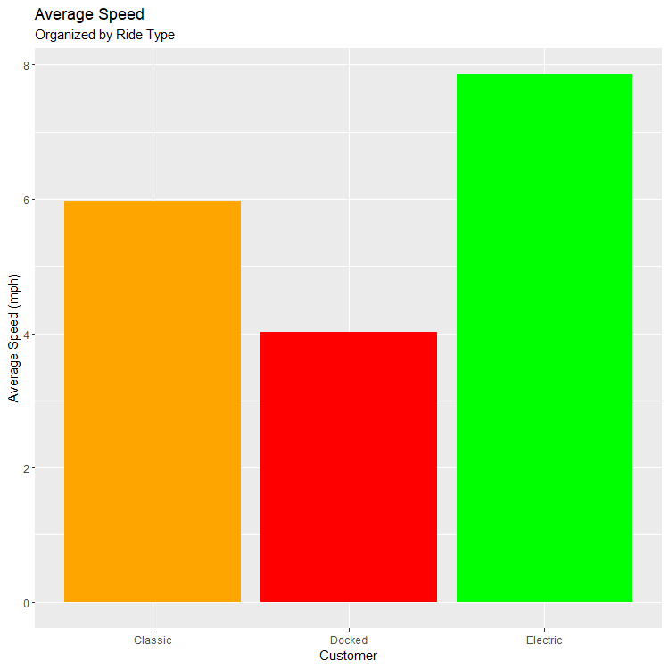
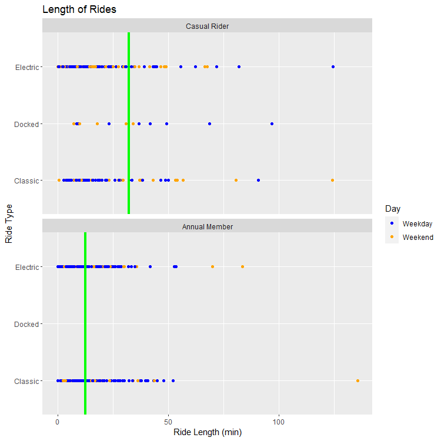
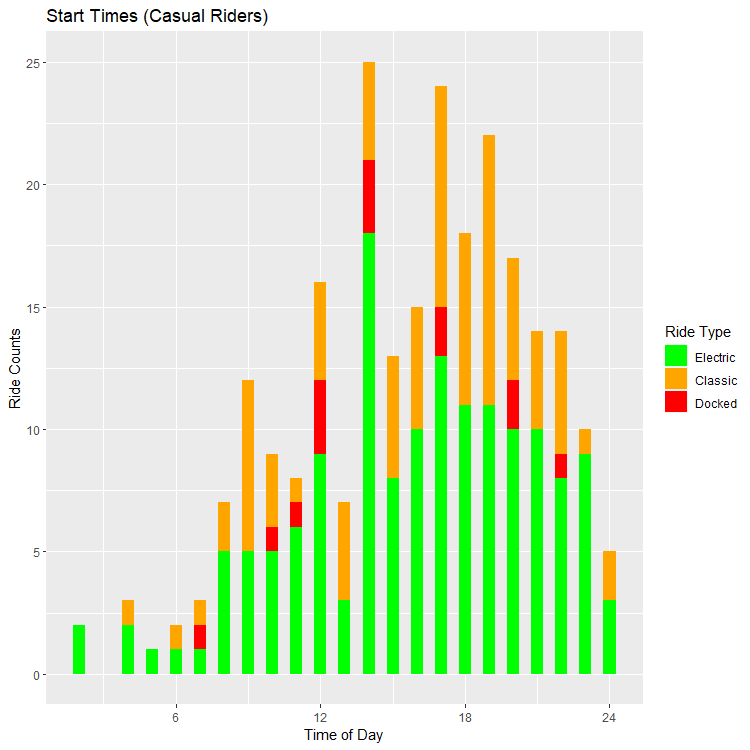
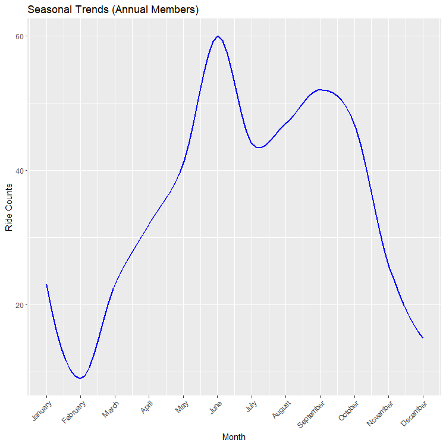
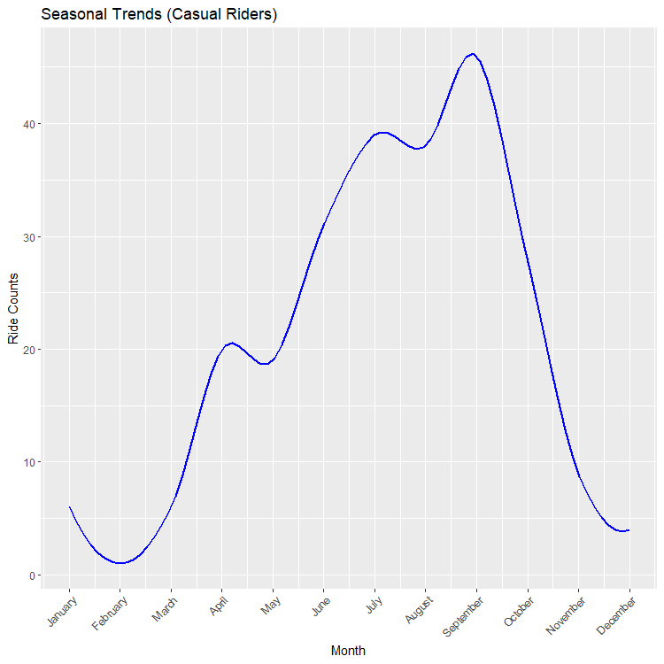
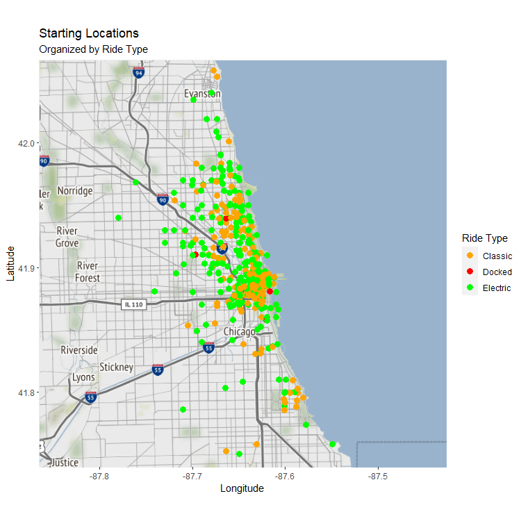
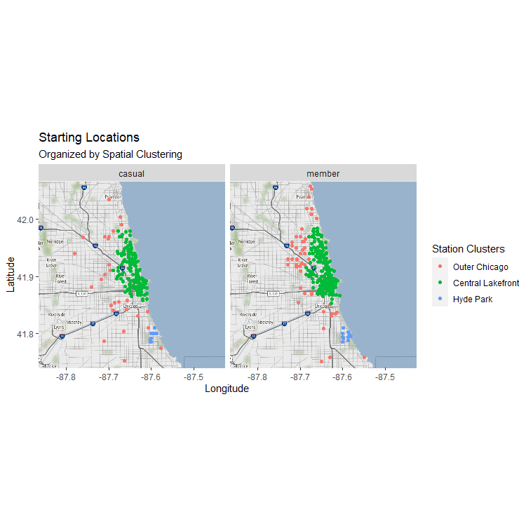
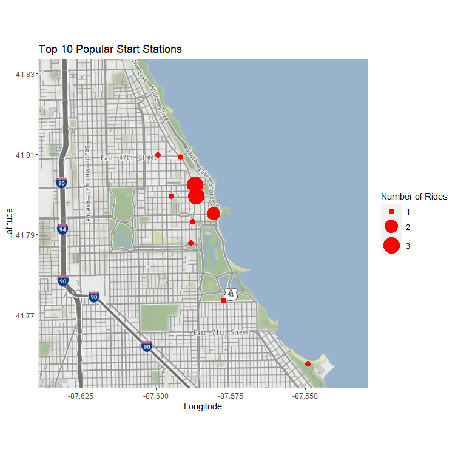

# Executive Summary
Cyclistic is a bike-sharing company based in Chicago on a mission to convert people who ride their bikes casually into annual paying members. By analyzing how Cyclistic members use their services and where overlap occurs with casual riders, I've identified key ways the company could achieve higher conversion rates.  

Through the analysis, I've discovered that members have little preference between electric and classic bikes, take shorter rides more frequently than casual riders (especially on weekends), like to ride a little faster, and enjoy biking around Chicago's Central Lakefront and university district in Hyde Park. They also ride the most around the months of June and September. Based on these insights, I've proposed several recommendations for Cyclistic's marketing and executive teams. 

* Focus on promotional content that highlights the versatility of Cyclistic's bike fleet with a nod to speed capacity of electric bikes
* Develop a marketing campaign that demonstrates the cost savings of an annual membership for frequent riders
* Promote the convenience and freedom of using Cyclistic's dockless capabilities with an annual membership 
* Launch seasonal advertising that targets casual riders during peak frequency months
* Increase the availability of Cyclistic's bike fleet along Central Lakefront and around Hyde Park
* Reach out to local businesses with cross-promotional offers

# Introduction
Cyclistic is a (fictional) bike-sharing service operating out of Chicago that successfully launched in 2016. Since their opening, their fleet has grown to 5824 bicycles, all of which are geotracked and connected to a network of nearly 700 stations across the city. Rides can begin and end anywhere in the city, unlockable for a small fee.

People wanting to use the service can either buy single-ride passes, full-day passes, or annual memberships. Those who buy single ride passes or full day passes are referred to as casual riders, Whereas those who purchase annual memberships are referred to as Cyclistic members. This flexibility of Cyclistic's pricing plans gave it a competitive edge when building the public's general awareness of the brand and marketing to a broad demographic of potential customers. 
Financial analysts at Cyclistic have demonstrated successfully that annual members are much more profitable to the company than casual riders, but why do some people buy single-ride or full-day passes while others purchase annual memberships? Does the length of rides have anything to do with this decision? What about bike preference or when people use bikes, how often, or where? How can analyzing the past twelve month's worth of ride-share data help Cyclistic create a more targeted campaign ad to convert casual riders into Cyclistic members?

By asking the right questions, keeping our sights focused on the business task, gathering and preparing relevant data for processing, analyzing it to look for any trends or helpful insights, and using simple maps and charts to visualize our analysis, I can inform Cyclistic's marketing team of potential next steps in their journey to activate annual members.
  
In order to provide Cyclistic, their marketing team, executive team, and other relevant stakeholders with valuable, accurate insights and data-driven suggestions to convert casual riders into annual members in pursuit of fiscal growth, I followed a programmatic analysis process that includes the following iterative steps:
  
  $$Ask - Prepare - Process - Analyze - Share - Act$$
  
We've already begun asking solid questions: here's how the data answers them.

# Data Cleaning
While working with the programming language R in R Studio, I stacked together 12 months of separate Cyclistic data into one dataset. This data set was quite large: it had 13 different qualities for almost six million bike rides, so I took a sufficient sample size that would ultimately render my insights accurate with a confidence level of 99% within a margin of error of 5. I use a variety of methods to ensure that the data contained within my sample set was indeed what I thought it would be, both in type and range. Upon finding a large amount null values, I performed some additional research to discover the context of these missing values and discovered they pose no threat to the analysis. 

# Analysis
The original dataset had 13 columns, but in order to perform a more thorough analysis it was necessary to produce additional columns that would display information about things like ride distance, speed, length, and type of day. All of the attributes in the finalized clean dataset are registered in the data dictionary below. 

## Data dictionary

+----------------------+----------------------------------------+
| Variable             | Meaning                                |
+======================+========================================+
| ride_id              | A signifier used to uniquely identify  |
|                      | each bike ride                         |
+----------------------+----------------------------------------+
| rideable_type        | Whether the bike ridden was electric,  | 
|                      | classic, or docked                     |
+----------------------+----------------------------------------+
| started_at           | The date and time the trip was started |
|                      |                                        |
+----------------------+----------------------------------------+
| ended_at             | The date and time the trip was ended   | 
|                      |                                        | 
+----------------------+----------------------------------------+
| start_station_name   | The name of the station where the trip |
|                      | began                                  |
+----------------------+----------------------------------------+
| start_station_id     | A unique identifier given to the       | 
|                      | station where the trip began           | 
+----------------------+----------------------------------------+
| end_station_name     | The name of the station where the trip |
|                      | ended                                  |
+----------------------+----------------------------------------+
| end_station_id       | A unique identifier given to the       | 
|                      | station where the trip ended           | 
+----------------------+----------------------------------------+
| start_lat            | The latitude of the starting location  |
|                      |                                        |
+----------------------+----------------------------------------+
| start_lng            | The longitude of the starting          |
|                      | location                               | 
+----------------------+----------------------------------------+
| end_lat              | The latitude of the ending location    |
|                      |                                        |
+----------------------+----------------------------------------+
| end_lng              | The longitude of the ending location   | 
|                      |                                        | 
+----------------------+----------------------------------------+
| member_casual        | Whether a rider is casual or an        |
|                      | annual member                          |
+----------------------+----------------------------------------+
| ride_length          | A calculated column containing the     |
|                      | ride length in minutes                 | 
+----------------------+----------------------------------------+
| is_weekday           | Whether the ride started on a weekday  |
|                      | (TRUE) or weekend (FALSE)              |
+----------------------+----------------------------------------+
| computed_distance    | The Haversine distance in miles        | 
|                      | between trip start and end locations   | 
+----------------------+----------------------------------------+
| ride_length_hours    | A calculated column containing the     |
|                      | ride length in hours                   |
+----------------------+----------------------------------------+
| speed_mph            | A calculated column displaying the         | 
|                      |   | 
+----------------------+----------------------------------------+
| cluster              | What cluster a starting point belongs  |
|                      | to                                     |
+----------------------+----------------------------------------+

## Key Findings
### Bike Preferences
Put yourself in the shoes of the average Cyclistic member. You may have a slight preference for electric bikes over classic bikes in regards to speed, but when it comes down to it, you just love the feeling of gliding down the road with the wind breezing by on a beautiful summer day. You enjoy riding Cyclistic's bikes because they provide you with the freedom to start and stop riding from wherever you're at to wherever you're going. This is exactly what electric and classic bikes do (and docked bikes don't). Taken together with the other key findings presented below, this is exactly what the data suggests about Cyclistic's annual members.

  <figure>
    
    <figcaption>Figure 1.1</figcaption>
  </figure>

  

  <figure>
    
    <figcaption>Figure 1.2</figcaption>
  </figure>

  <figure>
    
    <figcaption>Figure 1.3</figcaption>
  </figure>

### Ride Times, Duration, Frequency, and Distance
Our analysis shows that members feel less obligated to push a single trip to the limit because they've paid a flat rate. They bike more often and take shorter trips, as depicted by mean ride durations in green overlaying the graphs below. They are also more than three times as likely as casual riders to bike on a weekend when they have the free time away from work. 

  <figure>
    
    <figcaption>Figure 2.1</figcaption>
  </figure>

  <figure>
    
    <figcaption>Figure 2.2</figcaption>
  </figure>

  <figure>
    
    <figcaption>Figure 2.3</figcaption>
  </figure>

  <figure>
    
    <figcaption>Figure 2.4</figcaption>
  </figure>

### Seasonal Frequency
Seasonally, members typically ride the most leading up to and peaking in June, with a pretty dramatic decline as temperatures rise in July, kicking the pace back up in August and September. Casual riders also peak in September, a fortunate overlap that should not be overlooked by the marketing team. Running advertising campaigns during these peak times may capture the attention of casual riders seeking the benefits of a full membership. Because ridership falls flat across both groups almost entirely in February, Cyclistic should avoid wasting advertising and other resources promoting a campaign during the winter months.

  <figure>
    
    <figcaption>Figure 3.1</figcaption>
  </figure>

  <figure>
    
    <figcaption>Figure 3.2</figcaption>
  </figure>

### Preferred Locations
Both annual members and casual riders alike typically begin their journeys along the Central Lakefront, the region in Chicago containing some of the most populated and popular destinations. Moreover, The top 10 most popular starting locations are all grouped in and around Hyde Park, the university district. These two locations represent prime real estate for advertising campaigns focused on converting casual riders into annual members and may present opportunities for cross-promotional negotiations with local businesses.

  <figure>
    
    <figcaption>Figure 4.1</figcaption>
  </figure>

  <figure>
    
    <figcaption>Figure 4.2</figcaption>
  </figure>

  <figure>
    
    <figcaption>Figure 4.3</figcaption>
  </figure>

# Recommendations
Based on the information that we've gathered through our analysis, here are six simple recommendations for the Cyclistic marketing team:

* Focus on promotional content that highlights the versatility of Cyclistic's bike fleet with a nod to speed capacity of electric bikes
* Develop a marketing campaign that demonstrates the savings of a Cyclistic membership for frequent riders compared to annual costs of gas, car maintenance, time in traffic, tax rides, etc.  
* Promote the convenience of using Cyclistic's dockless bike fleet with an annual membership
* Launch seasonal advertising that targets casual riders during September
* Increase the availability of Cyclistic's bike fleet along Central Lakefront and around Hyde Park
* Reach out to local businesses in these areas with cross-promotional offers

# Conclusion
By conducting a thorough analysis of Cyclistic's bike share data in the past year, I have developed a package of recommendations that will increase the revenue for Cyclistic and the positive user experience of their customers.Taking these suggestions seriously will increase the conversion rate between casual riders and annual members and open up a doorway towards increasing sales and inflating membership subscriptions. To further analyze how the marketing team can drive these conversions, Cyclistic could look towards gathering more types of data about their customers. A simple way to do this would be through customer surveys, which would enable Cyclistic to understand rider motivations and offer specialized feedback, or capturing demographic information, payment methods, website interaction, weather conditions, and more. A treasure trove of data analysis could take place if we aggregated all of this information together and I'm thrilled to get the chance to continue.  

# Acknowledgmements
<!---
[@wickham2019tidyverse]
[@grolemund2011lubridate]
[@dowle2023datatable]
[@vanderloo2021datavalidation]
[@fischetti2022assertr]
[@xie2014knitr]
[@kahle2013ggmap]
[@hahsler2019dbscan]
-->

